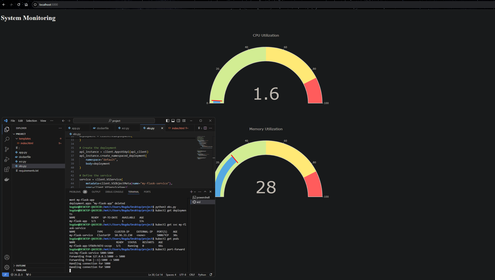

Overview:

This project uses Python to create a simple application, then Dockerizes the app for containerization. The Docker image is pushed to AWS Elastic Container Registry (ECR) for storage. Finally, the image is deployed on AWS Elastic Kubernetes Service (EKS) to manage and scale the application.

Features:

Simple Python app.

Dockerized the Python app for portability.

Pushed the Docker image to AWS ECR.

Deployed the application to AWS EKS using Kubernetes for scaling.

Automated and managed deployment on AWS.

Technologies Used

Before setting up the project, make sure you have the following:

AWS Account: An AWS account is needed to use AWS ECR and EKS.

AWS CLI: Command line interface to interact with AWS services. Install AWS CLI.

Docker: To build and manage Docker containers. Install Docker.

kubectl: Kubernetes command-line tool to interact with EKS. Install kubectl.

